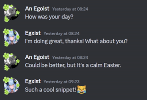
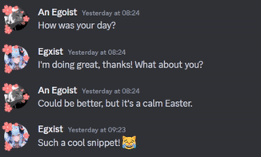
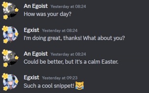

<div align="center">


# 🌼 FLOWERS 🌼

> 
> 
>
 ```css
background: url("https://cdn.discordapp.com/avatar-decoration-presets/v2_a_d6760c807d460b45e06427c09ab61390.png?size=128&passthrough=true") center/cover;
```
> 
> Green Flowers

- - - 

> 
> 
>
```css
background: url("https://cdn.discordapp.com/avatar-decoration-presets/v2_a_37dc2b53b273a457ff19ac2e3fda7e4c.png?size=160&passthrough=true") center/cover;
```
> 
> Pink Flowers

- - - 

> 
> 
>
```css
background: url("https://cdn.discordapp.com/avatar-decoration-presets/v2_a_9c70ff0db80d85ee6d9690a0eeded0c8.png?size=160&passthrough=true") center/cover;
```
> 
> Red Flowers

- - - 

> 
> 
>
```css
background: url("https://cdn.discordapp.com/avatar-decoration-presets/v2_a_669e4e5337a7ebeffd87fe3f1008535f.png?size=128&passthrough=true") center/cover;
```
> 
> Yellow Flowers


</div>
