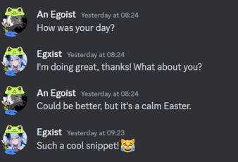
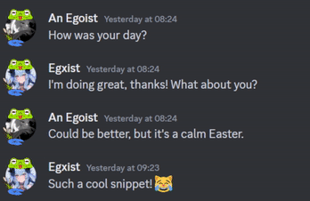
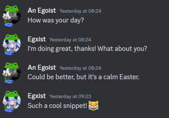
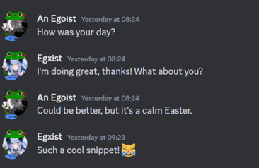
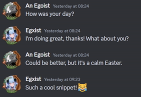
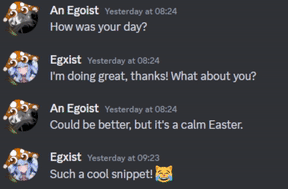
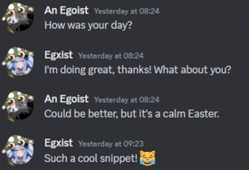
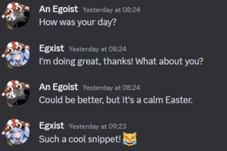
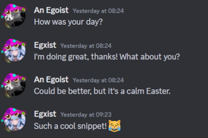

<div align="center">


# 🌼 FLOWERS 🌼

> 
> 
>
 ```css
background: url("https://cdn.discordapp.com/avatar-decoration-presets/v2_a_d6760c807d460b45e06427c09ab61390.png?size=128&passthrough=true") center/cover;
```
> 
> Green Flowers

- - - 

> 
> 
>
```css
background: url("https://cdn.discordapp.com/avatar-decoration-presets/v2_a_37dc2b53b273a457ff19ac2e3fda7e4c.png?size=160&passthrough=true") center/cover;
```
> 
> Pink Flowers

- - - 

> 
> 
>
```css
background: url("https://cdn.discordapp.com/avatar-decoration-presets/v2_a_9c70ff0db80d85ee6d9690a0eeded0c8.png?size=160&passthrough=true") center/cover;
```
> 
> Red Flowers

- - - 

> 
> 
>
```css
background: url("https://cdn.discordapp.com/avatar-decoration-presets/v2_a_669e4e5337a7ebeffd87fe3f1008535f.png?size=128&passthrough=true") center/cover;
```
> 
> Yellow Flowers


# 🐸 FROGS 🐸

> 
> 
>
```css
background: url("https://cdn.discordapp.com/avatar-decoration-presets/v2_a_8f4e2c88d0b00a2e6eefdbe0a70944ec.png?size=128&passthrough=true") center/cover;
```
> 
> Happy Frog

- - - 

> 
> 
>
```css
background: url("https://cdn.discordapp.com/avatar-decoration-presets/v2_a_683904e98e8e7bca912125d360293cc6.png?size=160&passthrough=true") center/cover;
```
> 
> Sticking Tongue Out Frog

- - - 

> 
> 
>
```css
background: url("https://cdn.discordapp.com/avatar-decoration-presets/v2_a_32c66e3421b5599cf0d1ebabc29dcd16.png?size=128&passthrough=true") center/cover;
```
> 
> Sad Frog

- - - 

> 
> 
>
```css
background: url("https://cdn.discordapp.com/avatar-decoration-presets/v2_a_c58a9fe37aa945ca41892f04fc61314b.png?size=128&passthrough=true") center/cover;
```
> 
> Angry Frog

# 🌲 FORESTAL 🌲

> 
> 
>
```css
background: url("https://cdn.discordapp.com/avatar-decoration-presets/v2_a_0b2d5d75d4f1287befda6b2180aec41d.png?size=160&passthrough=true") center/cover;
```
> 
> Autumn-like

- - - 

> 
> 
>
```css
background: url("https://cdn.discordapp.com/avatar-decoration-presets/v2_a_549ba042b8adef872b7a52ebb563dc69.png?size=128&passthrough=true") center/cover;
```
> 
> Brown Mushroom

- - - 

> 
> 
>
```css
background: url("https://cdn.discordapp.com/avatar-decoration-presets/v2_a_fc5d8621ab57442f49662f7f76a56212.png?size=128&passthrough=true") center/cover;
```
> 
> Green Mushroom

- - - 

> 
> 
>
```css
background: url("https://cdn.discordapp.com/avatar-decoration-presets/v2_a_9b1a98ba163aeea50dc0ca42988acf1d.png?size=128&passthrough=true") center/cover;
```
> 
> Red Mushroom

- - - 

> 
> 
>
```css
background: url("https://cdn.discordapp.com/avatar-decoration-presets/v2_a_33950b8d93e3ac1ae95c733d281fa7b5.png?size=128&passthrough=true") center/cover;
```
> 
> Purple Mushroom


</div>
